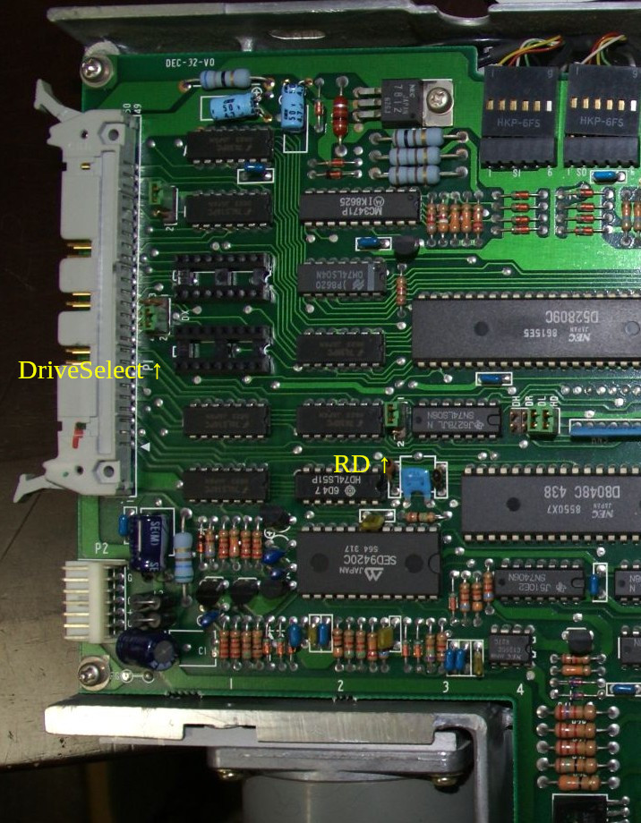
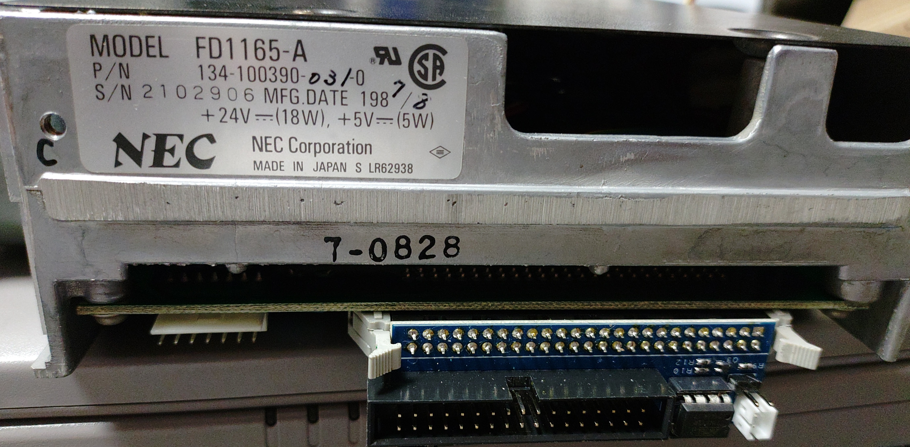
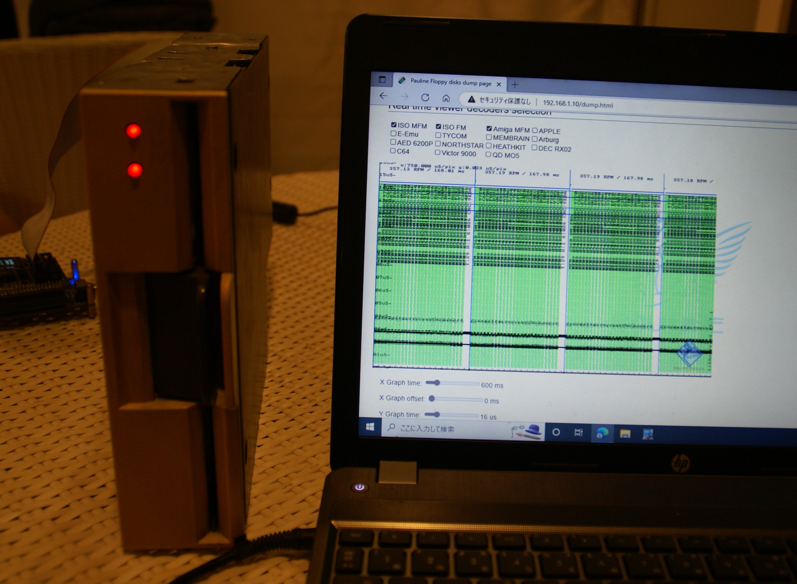

# How to use with Pauline

## Pauline Settings

Connect with a straight cable.
ストレートケーブルで接続します。

Set Pauline's Drive Script as follows
PaulineのDrive Scriptは以下のような設定にします。

```
set DRIVE_0_DESCRIPTION "8-inch Floppy drive"
set DRIVE_0_SELECT_LINE DRIVES_PORT_PIN10
set DRIVE_0_MOTOR_LINE  DRIVES_PORT_PIN16
set DRIVE_0_MAX_STEPS   76
```

The MOTOR signal is used for HEAD LOAD signal.
MOTOR信号でHEAD LOADの信号を賄うようにしています。

## FD1165A Setting

Jumper set as drive 1.
Turn off the VFO function. (RD jumper is set to the side of 2)
ジャンパーはドライブ１として設定
またVFOの機能は切っておきます。（RDのジャンパーは２の側へジャンパーを変更）


## Connection

Attach the board to the drive.
ボードをドライブに取り付けます。


Connect with a straight cable.
Power is supplied from the power supply board to the drive and Pauline.
ストレートケーブルで接続します。
電源基板から、ドライブ、Paulineへ電源供給します。

Dumping disk as usual.
後は通常通りPaulineで読み込みます。



