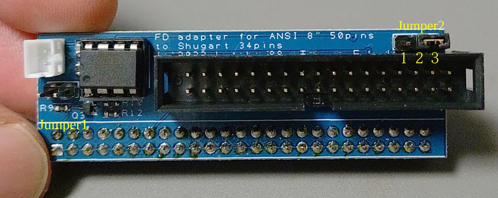

# board jumper info

## Jumper 1 
Select Drive model for Low current signal switching.
Short = YE data YE-180 1601
Open = NEC FD1165A

Low Currect信号の生成を機種によって変更するためのジャンパーです。
ショートするとYEデータのYE-180用となります
（low current はYEでは Write中の場合 　0~43でH 44~76でL。Read中は0~59でH 60~76でL）
オープンするとNEC　FD1165A用となります。
（NEC FD1165は、 read writeに関係なく0~42でH、43~76でL）

## Jumper 2
Select 34 pin signal (READY or DiskChange)
1-2 DiskChange (ANSI 8inch 12 pin to 34 pin)
2-3 READY (ANSI 8inch 22 pin to 34 pin)

通常の34ピンコネクターの34ピンにREADYかDiskChangeのどちらのラインを選択するかのジャンパーです。
1−2をショートするとDiskChangeが34ピンに接続されます
2−3をショートするとREADYが34ピンに接続されます

