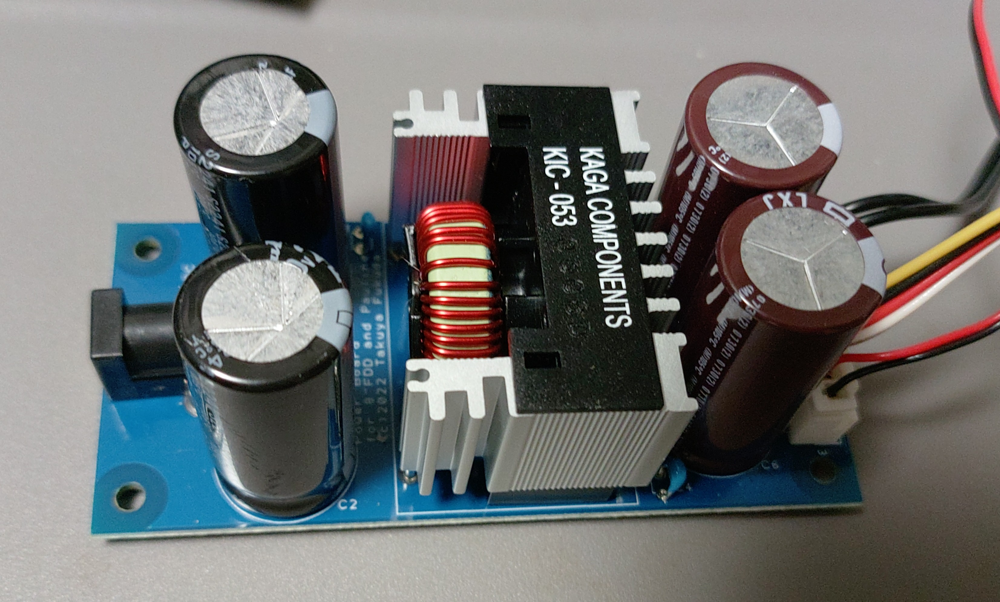
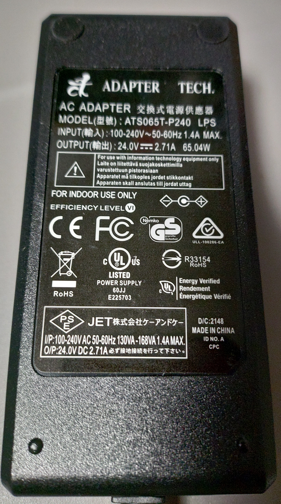
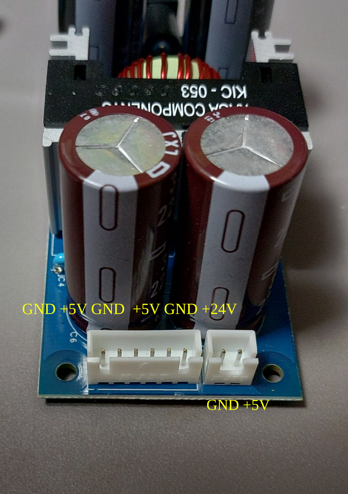
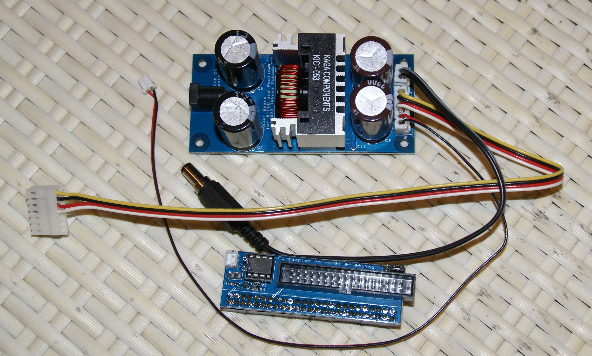
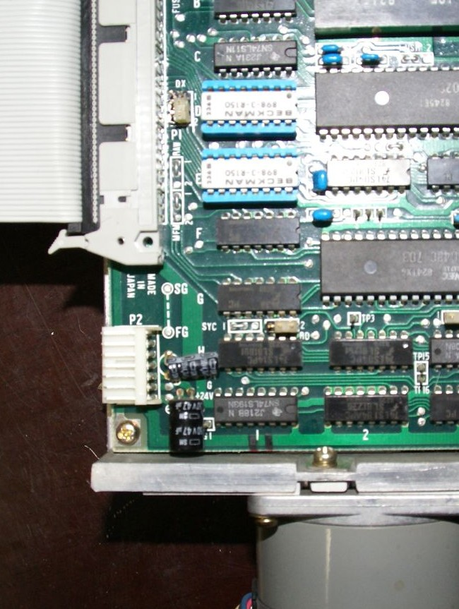

PCB was made with DesignSpark PCB Ver 10.0

Scheme is printed as PDF file.
Parts list is ODS file.

基板はDesignSpark PCB Ver10.0で作成しています。
gerberのフォルダにGerberとして出力しましています。それらをまとめたものもZIPファイルで置いてあります。
FusionPCBなどへ発注できると思います。

回路図はPDFファイルとしても参照可能です。
パーツリストは、ODSファイルに記載してあります。

The power supply board uses +24V DC power supply.
DC plug is an external diameter of 5.5 mm, an internal diameter of 2.1 mm, and a center-plus.
電源基板には+24Vの直流電源を使用します。
外形5.5mm、内径2.1mm、センタープラスのDCプラグで供給する形で作成しました。

The power outputs are XH 6pin connector for the 8" drive XH 2pin connector to supply power to the Pauline.
The output from each power supply pin is as shown in the image.

電源出力はXH6ピンが8インチドライブ用　XH2ピンがPaulineへの電源供給としています。
それぞれの電源ピンからの出力は画像に記載した通りです。

One of the +5V from the XH6 pin feeds this interface board.
The interface side is made with a 2-pin PH connector.
The remaining +5V and +24V are supplied to the drive.
Refer to the data sheet of each drive for the connector to be supplied to the drive.

XH6ピンからの+5Vの一つはこのインターフェスに供給します。
インターフェス側はPHコネクターの2ピンのもので作成しています。
残りの+5V、+24Vはドライブへ供給します。
ドライブへのコネクターはそれぞれのドライブのデータシートなどを参考に供給してください。

NEC　FD1165Aの場合は、EIコネクターの7ピンで、
1pin +24V
2pin GND
3pin +5V
4pin GND
です。

