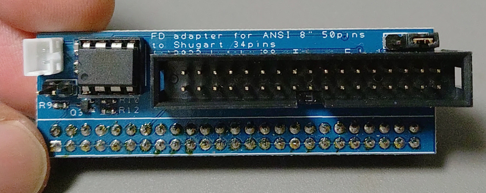
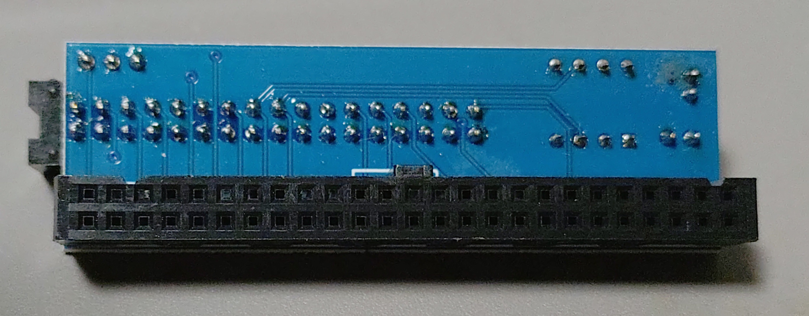

# ANSI 8 inch Floppy Disk Drive adapter and Power board
---

This interface and power board is made for ANSI 8 inch interface drives and Pauline or any other FDD dump devices.
You can dump (or maybe write) 8 inch disk with this boards.
(And may be use with PC/AT machines that have FDD interfaces)

I tested NEC FD1165A and Pauline.

このインターフェースはANSI仕様の８インチドライブを通常の３４ピンコネクターに変換するものです。
このインターフェースを利用することで、Paulineやその他のフロッピーディスク読み出し環境で８インチディスクを読み込むことが可能となります。
ドライブに合わせたLowCurrent信号を作成することが出来ます。

NEC製のFD1165Aを利用して読み込み可能であることをテストしています。

Takuya Fukuda
Twitter: @kitahei88

License
This project is released under BSD 3-Clause License
